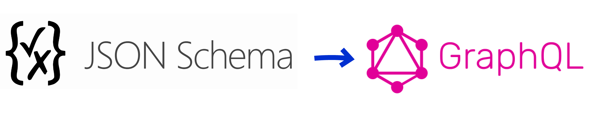

# JSON Schema to GraphQL converter

This library exports a single function, `convert`, which converts one or more [JSON schemas](https://json-schema.org/) to a [GraphQL schema]().

## Installation

Install with yarn:

```
yarn add jsonschema2graphql
```

## Usage

You can convert a schema expressed as an object literal:

```js
import { printSchema } from 'graphql'
import convert from 'jsonschema2graphql'

const jsonSchema = {
  $id: 'person',
  type: 'object',
  properties: {
    name: {
      type: 'string',
    },
    age: {
      type: 'integer',
    },
  },
}

const schema = convert({ jsonSchema })

console.log(printSchema(schema))
```

Output

```graphql
type Person {
  name: String
  age: Int
}
type Query {
  people: [Person]
}
```

Alternatively, you can provide the schema as JSON text.

```js
const schema = convert({
  jsonSchema: `{
    "$id": "person",
    "type": "object",
    "properties": {
      "name": {
        "type": "string"
      },
      "age": {
        "type": "integer"
      }
    }
  }`,
})
```

This will generate the same result as above.

To generate more than one type, provide an array of JSON schemas in either object or text form.

```js
const orange = {
  $id: 'Orange',
  type: 'object',
  properties: {
    color: {
      type: 'string',
    },
  },
}

const apple = {
  $id: 'Apple',
  type: 'object',
  properties: {
    color: { type: 'string' },
    bestFriend: {
      $ref: 'Orange', // <-- reference foreign type using $ref
    },
  },
}

const schema = convert({ jsonSchema: [orange, apple] })
```

Output

```graphql
type Apple {
  color: String
  bestFriend: Orange
}
type Orange {
  color: String
}
type Query {
  oranges: [Orange]
  apples: [Apple]
}`
```

### Custom root types (`Query`, `Mutation`, `Subscription`)

By default, a `Query` type is added to the schema, with one field defined per type, returning an array of that type. So for example, if you have an `Person` type and a `Post` type, you'll get a `Query` type that looks like this:

```graphql
type Query {
  people: [Person]
  posts: [Posts]
}
```

(Note that the generated name for the field is automatically [pluralized](https://github.com/blakeembrey/pluralize).)

By default, no `Mutation` or `Subscription` types are created.

To create a custom `Query` type and to add `Mutation` and/or `Subscription` blocks, provide an `entryPoints` callback that takes a hash of GraphQL types and returns `Query`, `Mutation` (optional), and `Subscription` (optional) blocks. Each block consists of a hash of `GraphQLFieldConfig` objects.

```js
const jsonSchema = [log, user, family]

const entryPoints = types => {
  return {
    query: new GraphQLObjectType({
      name: 'Query',
      fields: {
        family: { type: types['Family'] },
        user: {
          type: types['User'],
          args: {
            email: { type: types['Email'] },
          },
        },
      },
    }),
    mutation: new GraphQLObjectType({
      name: 'Mutation',
      fields: {
        stop: { type: types['Log'] },
      },
    }),
  }
}

const schema = convert({ jsonSchema, entryPoints })
```

See the GraphQL guide ["Constructing Types"](https://graphql.org/graphql-js/constructing-types/) for more on how to create GraphQL types programmatically.

Note that any types that are not referenced directly or indirectly by your root types will be omitted from the final schema.

## JSON schema feature support

> **Note:** This package is designed for use with schemas compliant with [JSON Schema Draft 7](https://json-schema.org/specification.html).

For clarity, the following examples only show the converted types; the `Query` type is omitted from the output.

### Basic types

Input

```js
{
  $id: 'Person',
  type: 'object',
  properties: {
    name: { type: 'string' },
    age: { type: 'integer' },
    score: { type: 'number' },
    isMyFriend: { type: 'boolean' },
  },
}
```

Output

```graphql
type Person {
  name: String
  age: Int
  score: Float
  isMyFriend: Boolean
}
```

### Array types

Input

```js
const jsonSchema = {
  $id: 'Person',
  type: 'object',
  properties: {
    name: {
      type: 'string',
    },
    luckyNumbers: {
      type: 'array',
      items: {
        type: 'integer',
      },
    },
    favoriteColors: {
      type: 'array',
      items: {
        type: 'string',
      },
    },
  },
}
```

Output

```graphql
type Person {
  name: String
  luckyNumbers: [Int!]
  favoriteColors: [String!]
}
```

#### Enums

Input

```js
const jsonSchema = {
  $id: 'Person',
  type: 'object',
  properties: {
    height: {
      type: 'string',
      enum: ['tall', 'average', 'short'], // <-- enum
    },
  },
}
```

Output

```graphql
type Person {
  height: PersonHeight
}

enum PersonHeight {
  tall
  average
  short
}
```

#### Required fields

Input

```js
const jsonSchema = {
  $id: 'Widget',
  type: 'object',
  properties: {
    somethingRequired: { type: 'integer' },
    somethingOptional: { type: 'integer' },
    somethingElseRequired: { type: 'integer' },
  },
  required: ['somethingRequired', 'somethingElseRequired'],
}
```

Output

```graphql
type Widget {
  somethingRequired: Int!
  somethingOptional: Int
  somethingElseRequired: Int!
}
```

#### Foreign references using `$ref`

Input

```js
const jsonSchema = {
  {
    $id: 'Orange',
    type: 'object',
    properties: {
      color: {
        type: 'string',
      },
    },
  },
  {
    $id: 'Apple',
    type: 'object',
    properties: {
      color: { type: 'string' },
      bestFriend: {
        $ref: 'Orange', // <-- reference foreign type using $ref
      },
    },
  },
]
```

Output

```graphql
type Apple {
  color: String
  bestFriend: Orange
}

type Orange {
  color: String
}
```

#### Union types using `oneOf`

Input

```js
const jsonSchema = {
  {
    $id: 'Parent',
    type: 'object',
    properties: {
      type: { type: 'string' },
      name: { type: 'string' },
    },
  },
  {
    $id: 'Child',
    type: 'object',
    properties: {
      type: { type: 'string' },
      name: { type: 'string' },
      parent: { $ref: 'Parent' },
      bestFriend: { $ref: 'Person' },
      friends: {
        type: 'array',
        items: { $ref: 'Person' },
      },
    },
  },
  {
    $id: 'Person',
    oneOf: [{ $ref: 'Parent' }, { $ref: 'Child' }],
  },
]
```

Output

```graphql
type Child {
  type: String
  name: String
  parent: Parent
  bestFriend: Person
  friends: [Person!]
}

type Parent {
  type: String
  name: String
}

union Person = Parent | Child
```

Properties defined as `oneOf` with `if`/`then` are also supported. For example, this:

```js
const jsonSchema = {
  $id: 'Person',
  oneOf: [
    {
      if: { properties: { type: { const: 'Parent' } } },
      then: { $ref: 'Parent' },
    },
    {
      if: { properties: { type: { const: 'Child' } } },
      then: { $ref: 'Child' },
    },
  ],
}
```

generates the same `union` type as above:

```graphql
union Person = Parent | Child
```

#### Descriptions for types and fields

Input

```js
const jsonSchema = {
  $id: 'person',
  type: 'object',
  description: 'An individual human being.',
  properties: {
    name: {
      type: 'string',
      description: 'The full name of the person.',
    },
    age: {
      type: 'integer',
      description: "The elapsed time (in years) since the person's birth.",
    },
  },
}
```

Output

```graphql
"""
An individual human being.
"""
type Person {
  """
  The full name of the person.
  """
  name: String
  """
  The elapsed time (in years) since the person's birth.
  """
  age: Int
}
```

### To do

The following features are not currently supported, but I'd like to add them for completeness. Pull requests are welcome.

- [ ] Combining JSON schemas with `allOf`, `anyOf`, or `not`
- [ ] Generating GraphQL input types

---

### Acknowledgements

Derived from [json-schema-to-graphql-types](https://github.com/lifeomic/json-schema-to-graphql-types) by [Matt Lavin](https://github.com/mdlavin) (matt.lavin@gmail.com).

Built with [typescript-starter](https://github.com/bitjson/typescript-starter) by [Jason Dreyzehner](https://github.com/bitjson) (github@bitjson.com).

MIT License
